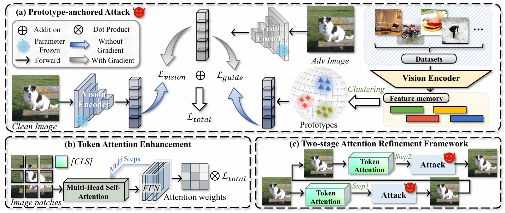

# PA-Attack: Guiding Gray-Box Attacks on LVLM Vision Encoders with Prototypes and Attention

Hefei Mei, Zirui Wang, Chang Xu, Jianyuan Guo, Minjing Dong 

Paper: https://arxiv.org/pdf/2602.19418



## Requirements

Our environment:

- CUDA=11.8
- Python=3.11

To install the required packages for white-box VEAttack, run:

```
pip install -r requirements.txt
```

To evaluate the transfer attack of VEAttack, you can follow the installation of [Qwen3-VL](https://github.com/QwenLM/Qwen3-VL) and [InternVL2](https://github.com/OpenGVLab/InternVL).


## LLaVA and OpenFlamingo

### Prototype Generation

```
# For LLaVA:
CUDA_VISIBLE_DEVICES=0 bash bash/llava_prototype_generation.sh
# For OpenFlamingo:
CUDA_VISIBLE_DEVICES=0 bash bash/of_prototype_generation.sh
```

You can use `python download_ai2d_dataset.py` and `python download_cdip_dataset.py` to download ScienceQA and RVL-CDIP datasets. And use `prototype/prototype_pca_ood.py` for `bash/llava_prototype_generation.sh` to generate out-of-distribution guidance.

### Attack Evaluation

For captioning and VQA tasks, evaluation can be performed by modifying the -- eval_coco instruction in the args to eval_flicker30, eval_textvqa, and eval_vqav2.

```
# For LLaVA-7b:
CUDA_VISIBLE_DEVICES=0 bash bash/llava_7b_paattack_coco.sh
# For LLaVA-13b:
CUDA_VISIBLE_DEVICES=0 bash bash/llava_13b_paattack_coco.sh
# For OpenFlamingo:
CUDA_VISIBLE_DEVICES=0 bash bash/of_eval_9B_paattack.sh
```

For POPE tasks, it can be achieved by modifying the baseModel declaration 'LLAVA' or 'openFlamingo' in the shell file.

```
# For clean performance:
CUDA_VISIBLE_DEVICES=0 bash bash/eval_pope_clean.sh
# For VEAttack performance:
CUDA_VISIBLE_DEVICES=0 bash bash/eval_pope_veattack.sh
# For PA-Attack performance:
CUDA_VISIBLE_DEVICES=0 bash bash/eval_pope_paattack.sh
```

## Qwen3-VL

### Prototype Generation

We use COCO dataset to generate prototype and test on ODinW and RealWorldQA.

```
CUDA_VISIBLE_DEVICES=0 python evaluation/Prototype/run_realworldqa_prototype.py
```

### ODinW-13

Download ODinW-35 dataset in [GLIP](https://huggingface.co/GLIPModel/GLIP/tree/main/odinw_35), then get ODinW-13 dataset use:

```
bash data/setup_odinw.sh
```

Get ODinW-13 dataset config use (We have put it in data/odinw):

```
python data/generate_config.py
```

After configuring the 'qwen3' environment following Qwen3-VL, we use the attacking file `evaluation/ODinW-13/modeling_file/modeling_qwen3_vl_paattack.py` to replace the `/home/anaconda3/envs/qwen3/lib/python3.10/site-packages/transformers/models/qwen3_vl/modeling_qwen3_vl.py`. Then evaluate by runing:

```
CUDA_VISIBLE_DEVICES=0 python evaluation/ODinW-13/run_odinw_attack.py infer --data-dir ./data/odinw --output-file results/odinw_random500_paattack.jsonl --limit 500

CUDA_VISIBLE_DEVICES=0 python evaluation/ODinW-13/run_odinw_attack.py eval --data-dir ./data/odinw --input-file results/odinw_random500_paattack.jsonl
```

### RealWorldQA

Prepare the dataset following the `evaluation/RealWorldQA/README.md` and get:

```
data/
├── RealWorldQA.tsv          # Main data file (auto-downloaded)
└── images/
    └── RealWorldQA/         # Decoded image files
```

Then evaluate by runing:

```
CUDA_VISIBLE_DEVICES=0 python /home/zirui/Qwen3-VL/evaluation/RealWorldQA/run_realworldqa_paattack_subset.py --output-file results/qwen3_paattack_subset100_onlytarget.jsonl --limit 500

python evaluation/RealWorldQA/run_realworldqa.py eval --data-dir ./data --input-file results/qwen3_paattack_results.jsonl --output-file results/paattack_score.csv
```

## InternVL2

After configuring the 'internvl' environment following InternVL2, we download the InternVL2-8B model in `evaluation/InternVL`:

```
pip install -U "huggingface_hub[cli]"
huggingface-cli download OpenGVLab/InternVL2-8B --local-dir ./evaluation/InternVL/InternVL2-8B --local-dir-use-symlinks False
```

### Prototype Generation

We use COCO dataset to generate prototype and test on RealWorldQA and POPE.

```
CUDA_VISIBLE_DEVICES=0 python evaluation/InternVL/run_internvl_prototype2.py
```

### RealWorldQA

We use the attacking file `evaluation/InternVL/vision_encoder/modeling_intern_vit_paattack.py` to replace the `evaluation/InternVL/InternVL2-8B/modeling_intern_vit.py`. Then evaluate by runing:

```
CUDA_VISIBLE_DEVICES=0 python Qwen3-save/Qwen3-VL/evaluation/InternVL/run_internvl_subset.py

python evaluation/RealWorldQA/run_realworldqa.py eval --data-dir ./data --input-file results/internvl_paattack_results_sub500_100_200.jsonl --output-file results/paattack_score.csv
```

### POPE

```
CUDA_VISIBLE_DEVICES=0 python evaluation/InternVL/run_internvl_pope.py --model-path ./evaluation/InternVL/InternVL2-8B --pope-file ./data/POPE/coco_pope_random.json --output-file results/pope_random_baseline_alldata.json --limit 500
```

## Acknowledgement

Our code is implemented based on [VEAttack](https://github.com/hfmei/VEAttack-LVLM), [LLaVA](https://github.com/haotian-liu/LLaVA), [OpenFlamingo](https://github.com/mlfoundations/open_flamingo), [Qwen3-VL](https://github.com/QwenLM/Qwen3-VL) and [InternVL2](https://github.com/OpenGVLab/InternVL). Thanks for their excellent works.

## Citation

If you find this repository useful, please consider citing our paper:

```
@article{mei2025veattack,
  title={VEAttack: Downstream-agnostic Vision Encoder Attack against Large Vision Language Models},
  author={Mei, Hefei and Wang, Zirui and You, Shen and Dong, Minjing and Xu, Chang},
  journal={arXiv preprint arXiv:2505.17440},
  year={2025}
}

@article{mei2026pa,
  title={PA-Attack: Guiding Gray-Box Attacks on LVLM Vision Encoders with Prototypes and Attention},
  author={Mei, Hefei and Wang, Zirui and Xu, Chang and Guo, Jianyuan and Dong, Minjing},
  journal={arXiv preprint arXiv:2602.19418},
  year={2026}
}
```
